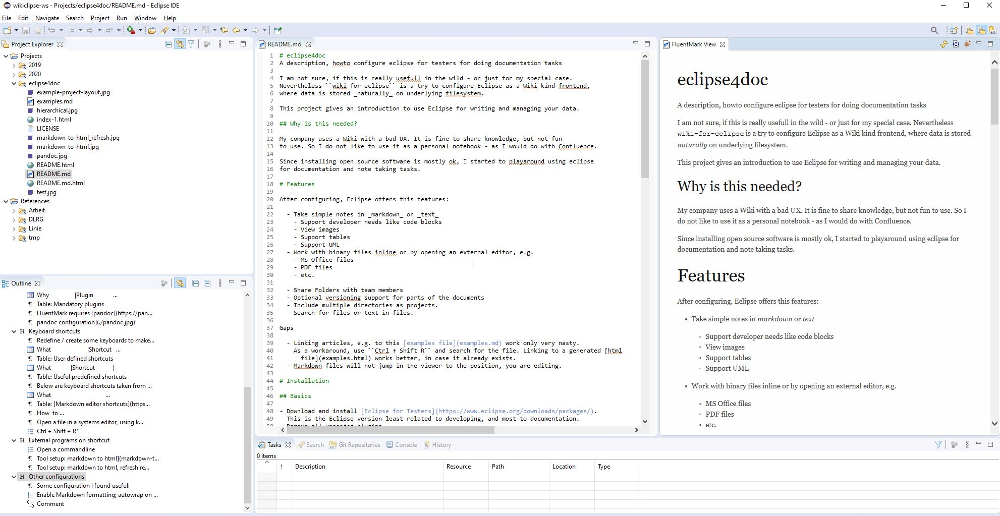
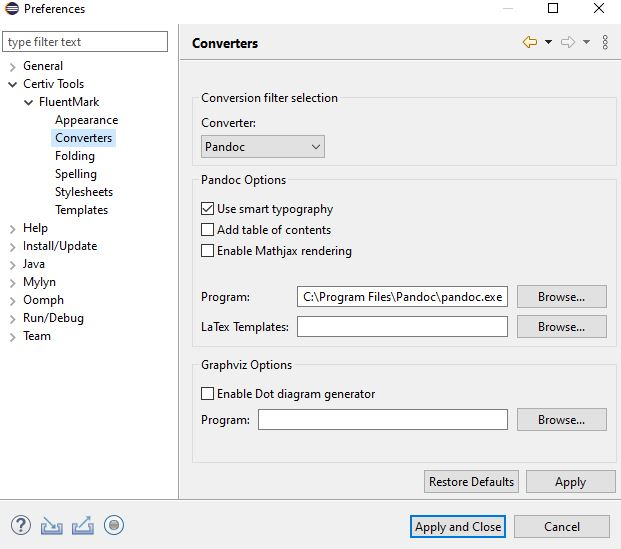
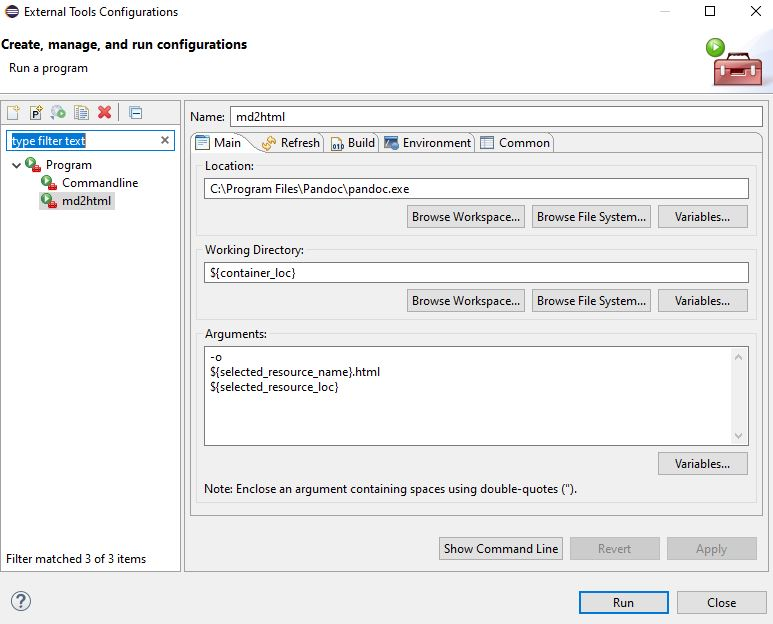
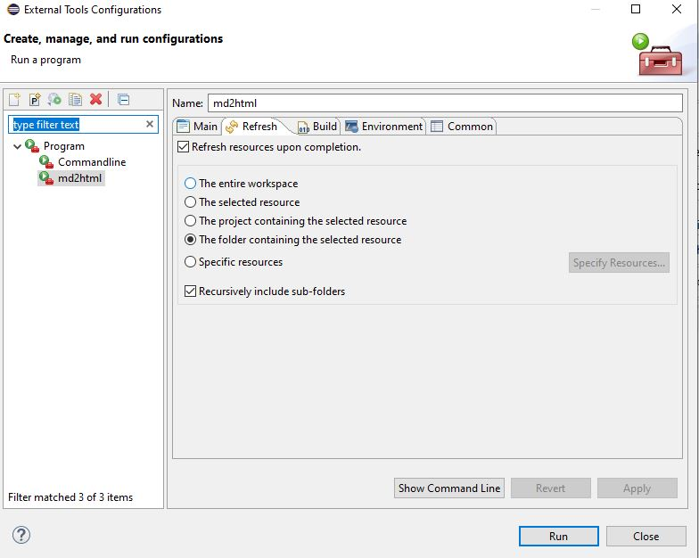
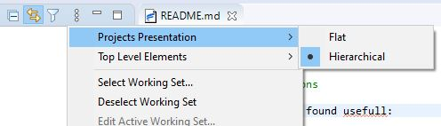
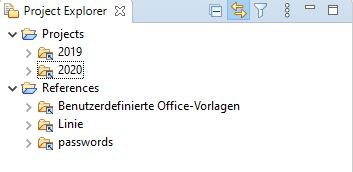

# eclipse4doc
A description, howto configure eclipse for testers for doing documentation tasks

I am not sure, if this is really usefull in the wild - or just for my special case. 
Nevertheless ``wiki-for-eclipse`` is a try to configure Eclipse as a Wiki kind frontend, 
where data is stored _naturally_ on underlying filesystem.

This project gives an introduction to use Eclipse for writing and managing your data.

## Why is this needed?

My company uses a Wiki with a bad UX. It is fine to share knowledge, but not fun 
to use. So I do not like to use it as a personal notebook - as I would do with Confluence. 

Since installing open source software is mostly ok, I started to playaround using eclipse 
for documentation and note taking tasks.

# Features

After configuring, Eclipse offers this features:

  - Take simple notes in _markdown_ or _text_
    - Support developer needs like code blocks
    - View images
    - Support tables
    - Support UML
  - Work with binary files inline or by opening an external editor, e.g.
    - MS Office files
    - PDF files
    - etc.

  - Share Folders with team members
  - Optional versioning support for parts of the documents
  - Include multiple directories as projects.
  - Search for files or text in files.

Gaps

  - Linking articles, e.g. to this [examples file](examples.md) work only very nasty. 
    As a workaround, use ``Ctrl + Shift R`` and search for the file. Linking to a generated [html 
      file](examples.html) works better, in case it already exists.
  - Markdown files will not jump in the viewer to the position, you are editing.

# Installation

## Basics

- Download and install [Eclipse for Testers](https://www.eclipse.org/downloads/packages/). 
  This is the Eclipse version least related to developing, and most to documentation.
- Remove all unneeded plugins
  - Jubula
  - Mylan
  - Oomph
- Disable automatic builds (Project / Build Automatically)

## Additional plugins

- To support git based versioning use
- to support images use

|Why                 |Plugin                                                          |
|:-------------------|:---------------------------------------------------------------|
|**Markdown Support**|[FluentMark](https://marketplace.eclipse.org/content/fluentmark)| 
|Versioning          |[egit](https://www.eclipse.org/egit/)                           |
|Image viewer        |[QuickImage](https://marketplace.eclipse.org/content/quickimage)| 

Table: Mandatory plugins

FluentMark requires [pandoc](https://pandoc.org/) and [graphviz](http://www.graphviz.org/) 
to work properly. Pandoc is a Latex based markdown converter and graphviz is usefull 
to draw diagrams using _plantuml_.

## Keyboard shortcuts

Redefine / create some keyboards to make working with files more easy:

|What                        |Shortcut            |
|:---------------------------|:-------------------|
|New file by name            |``Ctrl + Shift + N``|
|Open markdown viewer        |``Ctrl + Shift + M``|
|Show file in system explorer|``Ctrl + Shift + E``|

Table: User defined shortcuts

|What             |Shortcut            |
|:----------------|:-------------------|
|New file wizard  |``Ctrl + N``        |
|List of shortcuts|``Ctrl + Shift + L``|
|Find files, etc. |``Ctrl + H``        |

Table: Useful predefined shortcuts

Below are keyboard shortcuts taken from the fluentmark documentation, for working 
with _markdown files_. 

|What                                              |Shortcut            |
|:-------------------------------------------------|:-------------------|
|Opens the template assist popup                   |``Ctrl + Space``    |
|Spell check quick correct                         |``Ctrl-1``          |
|Toggles bold of selected text                     |``Ctrl-b``          |
|Toggles italics of selected text                  |``Ctrl-i``          |
|Toggles Markdown-style commenting of selected text|``Ctrl-/``          |
|Toggles HTML-style commenting of selected text    |``Ctrl-Shift-/``    |
|Format - full page or selection                   |``Ctrl-Shift-f``    |
|Format - with unwrapped text                      |``Ctrl-Shift-Alt-f``|

Table: [Markdown editor shortcuts](https://github.com/grosenberg/fluentmark)

How  to ...

Open a file in a systems editor, using keyboards:

- ``Ctrl + Shift + R``
- Find file to edit
- ``Alt + h``
- Select Editor using arrow keys

## External programs on shortcut

- Open a commandline
- Use pandoc to create html files from markdown files in same directory

## Other configurations

Some configuration I found useful:

- Enable Markdown formatting; autowrap on 80 characters. (Window / Preferences / 
  Certiv Tools / FluentMark)
- Restrict open editors to 3..6 and auto close files.
- Hierarchical layout 

<!---- 
Set a dictionary in your language, German in my case (Window / Preferences / General)
--->

# Example Setup

# References

- [Preview files in Eclipse, Stackoverflow](https://stackoverflow.com/questions/12321591/how-to-have-eclipse-automatically-open-preview-files-as-i-select-them-in-project)

