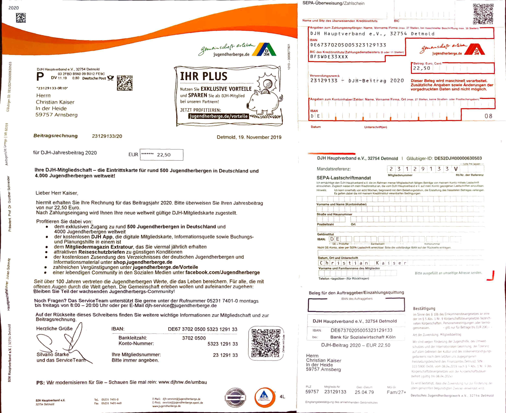
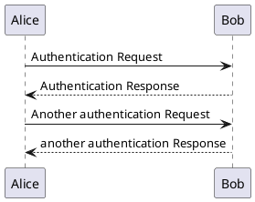

# Source code

## Java 
```java
private class Foo {
  private String xxx = "xxx";
  public int fortytwo = 42;
}
```

## Dot / Uml


# Images

{ width=400px }

# Tables

|Why             |Plugin                               |
|:---------------|:------------------------------------|
|Versioning      |[egit](https://www.eclipse.org/egit/)|

Table: A Table with a caption

# UML

